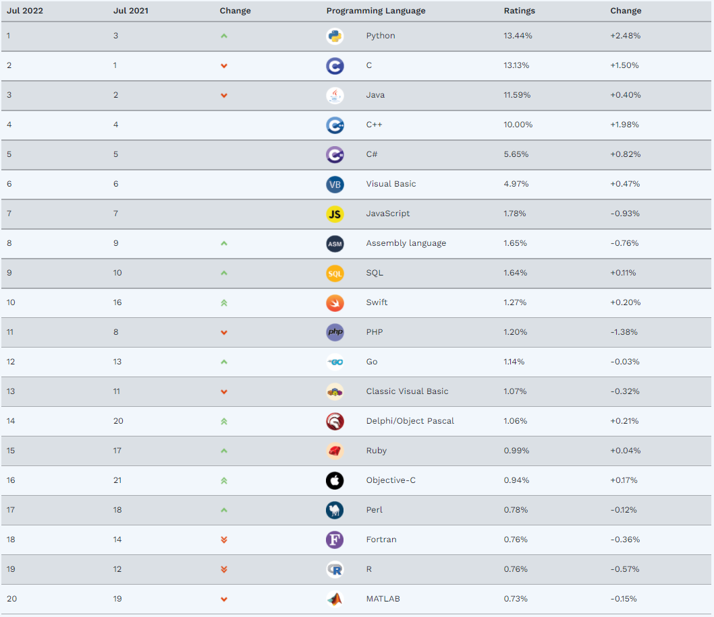

<style>
div.center {
  text-align: center;
}

div.left {
  text-align: left;
}

div.right {
  text-align: right;
} 

div.justify {
  text-align: justify;
} 
</style>

```{r, setup, include=FALSE}
graphics.off()
rm(list = ls())
gc()

knitr::opts_chunk$set(echo=FALSE, 
                      message=FALSE, 
                      warning=FALSE,
                      fig.align = "center",
                      fig.width = 7,
                      cache=TRUE,
                      dpi = 96
)

```

```{r,out.width="100%"}
knitr::include_graphics('D:/R/projects/industry_news/title.png')

```

<br>  
<br>  

## 잡설  

지난 주에 회사의 데이터 분석팀, 데이터 사업팀, RMS팀의 팀장님을 포함한 실무진들과 미팅을 가졌습니다.  

우리회사는 Apache Spark(Framework) - Apache Zeppelin(Web based Notebook) - Scala(Java와 호환가능한 다중패러다임 프로그래밍 언어)구조로 사용하는 시스템이었습니다. 

뭐랄까 너무 많이 나가버렸다`r emo::ji('rocket')`는 느낌을 받았습니다.  

설계를 하거나 현장을 뛰는 엔지니어들은 여전히 마차를 타고 다니는데 데이테 분석 조직은 드론을 타고 다니는 느낌이었습니다.  

현업에 데이터 분석을 도입해보겠다고 자신있게 갔건만... 현실은 너무 큰 차이로 인해 서로를 어떻게 이해시켜야 하나 걱정만 늘었습니다.  

그래도 뿌듯하기도 했던 것이 우리회사도 놀고 있지만은 않았구나.  

나름대로 발맞추어 가고 있었구나 하는 생각도 들면서, 역시! 내가 열심히 하지 않아도 다들 열심히 내 월급`r emo::ji('dollar')`을 벌어주는구나 하는 안도감이 들었습니다.  

<br>

### 하나 - 나는 내가 무엇을 아는지 알고 있다.  

이젠 이런 것까지 하는가 싶은 내용입니다.  

현재 인공지능이 가진 문제 중 하나가 이 인공지능이 하는 대답을 얼마나 믿을 수 있는지를 판별하는 것입니다.  

사실 인공지능 스스로 자신의 대답을 얼마나 신뢰하고 있는지도 알 수 없는 상황이죠.  


<br>

[Language Models (Mostly) Know What They Know](https://arxiv.org/abs/2207.05221)

<br>

놀랍게도 이 신뢰도? 정직함?을 인공지능 스스로 학습시켜 자기가 한 대답에 대한 평가를 스스로 하게 해본 시도입니다.    

결과가 나쁘지 않다고 합니다.  

이제 인공지능이 스스로 옳은 답을 하는지 검증하는 단계가 눈 앞에 와 있는 듯 합니다.  

```{r ,out.width="50%"}
knitr::include_graphics('https://external-preview.redd.it/tzJKRXiQGdDAVCHcN4h_vkL6ho7QIUnz2aVTNPqxLTc.jpg?auto=webp&s=5ad6675baf3c7df6a74a242cc1f5bf89b200eb21')

```


<br>
<br>


### 둘 - TIOBE Index for July 2022

TIOBE 프로그래밍 커뮤니티 지수는 네덜란드 에인트호벤에 기반을 둔 TIOBE Software BV에서 만들고 유지 관리하는 프로그래밍 언어의 인기도를 측정한 것인데 마침 Scala 이야기가 나와서 이번 달 순위를 한 번 찾아봤습니다.  

이 순위는 검색엔진을 통해 얼마나 많은 관련 글이 올라왔는지를 통해 순위가 도출되기 때문에 실제와 다르다는 의견이 있지만 점유율 변화로 해당 언어의 미래를 예측해볼 수 있다는 점에서는 유용하다고 생각합니다.  

Python이 부동의 1위를 달성 중에 있습니다. C와 Java를 모두 밀어내고 올라왔는데 상승세가 꺾이지 않고 있습니다.  

금수저 Swift는 무시무시한 속도로 올라오고 있습니다. 10위권에 들어오는건 시간문제인 듯 합니다.  

Fortran, R, MATLAB은 안타깝습니다. `r emo::ji('cry')`

Scala는 Kotlin 바로 위인 34위를 차지하고 있습니다.  

20위권 밖은 관심을 가지지 않고 있어 잘 안 봤는데 놀랍게도 Scratch가 21위입니다!!!   

<br>

[TIOBE Index for July 2022](https://www.tiobe.com/tiobe-index/)

<br>


```{r ,out.width="100%"}


```


<br>
<br>


--- 

<br>  

## 새로운 소식들

<br>  

### New method to evaluate performance, LCOE of elevated agrivoltaics

<br>  

[기사링크](https://www.pv-magazine.com/2022/07/13/new-method-to-evaluate-performance-lcoe-of-elevated-agrivoltaics/)    

<br>

벨기에 연구진이 영농형 태양광 관련하여 새로운 연구결과를 발표  

그늘에서도 잘 자라는 감자, 사탕무 등의 식물과 영농형 태양광을 연계할 경우 유럽에서만 1290GW의 영농형 태양광이 가능  

그늘에 민감한 작물도 있기 때문에 영농형 태양광 관련 제도를 도입할 때 태양광 모듈에 의한 그늘이 지표면을 가리는 비율에 대한 규제가 같이 필요하다는 점을 강조  

<br>  

```{r}
knitr::include_graphics('https://16iwyl195vvfgoqu3136p2ly-wpengine.netdna-ssl.com/wp-content/uploads/2021/03/03022_06-agrophotovolt_opt.jpeg')

```

<br>  

국내 태양광 발전에 대해 이야기할 때 반대하는 학자들이 들고 나오는 것이 장마에 대한 이야기입니다.  

그늘에서 발육이 더뎌지는 작물 때문에 영농형 태양광을 할 수 없다고 주장한 것과 다름없어 보입니다.  

수상형 태양광도 마찬가지입니다. 이러한 점을 고려한 정책과 운영방법을 나누는 좀 더 성숙한 모습이 많이 보였으면 좋겠습니다.  

<br>  

### US Crosses the Electric-Car Tipping Point for Mass Adoption  

발전원으로 석탄, 원자력과 같은 과거 발전연료를 선호하는 분들이 있듯, 자동차에서는 내연기관을 (정확하게는 가솔린) 애착하는 사람들이 있습니다.  

내연기관의 장점으로 내연기관이 사라지지 않거나, 내연기관이 사라지기에는 매우 오랜시간이 걸린다는 내용과 이를 뒷받침하는 수 많은 근거를 제시하고 있습니다.  

또는 모두 전기차를 타더라도 나는 내연기관의 감성(?)을 버리지 않을 것이라 주장하시는 분들도 있습니다.  

하지만 세상는 생각보다 더욱 더 빠른 속도로 전기차의 시대로 넘어가고 있습니다.  

<br>

[기사링크](https://www.bloomberg.com/news/articles/2022-07-09/us-electric-car-sales-reach-key-milestone)  

미국 신차 판매의 5%가 전기차 판매 비율  

이로써 세계 3대 자동차 시장 - 미국, 유럽, 중국 - 이 모두 티핑포인트를 넘어섰음  

이는 기존 예측보다 1~2년정도 앞선 추세로 이러한 추세라면 2025년 신차 판매의 25%가 전기차가 될 수도 있음  

<br>  

```{r}
knitr::include_graphics('https://assets.bwbx.io/images/users/iqjWHBFdfxIU/iTUi_KWNO_fk/v1/800x-1.jpg')

```

<br>  

5%의 티핑포인트가 중요한 이유는 새로운 기술은 S자형 채택곡선을 따르는 추세가 있음  

초반에는 얼리 어댑터들이 사용하다가 일단 주류가 되었다고 인식되는 순간 놀라울 정도로 빠르게 확산되고 이후에는 기존 기술을 포기하지 못하는 소수들에게 서서히 확산되는 추세를 가짐  

예를 들어 아직도 피처폰을 사용하는 극소수의 사람들이 이러한 S자형 채택곡선의 가장 끝에 있는 것임  

전기차의 경우 5%의 판매율은 주류 수요가 진입하기 시작하는 지점으로 볼 수 있으며, 이후 빠르게 수요가 증가할 것으로 예측할 수 있음  


<br>  

### Indeck Niles 1.1 GW energy centre comes online  

<br>

[기사링크](https://www.modernpowersystems.com/news/newsindeck-niles-11-gw-energy-centre-comes-online-9842858)  

<br>  

7월 1일 Indeck Energy Services는 한국 파트너인 한국남부발전 및 DL Energy와 함께 Indeck Niles Energy Center의 상업 운영 시작을 발표  

Indeck Niles는 2개의 GE 7HA.02 가스 터빈을 기반으로 하는 1.1GW 천연 가스 복합화력 발전소임  

GE는 H-클래스 복합화력발전소 장비를 납품했으며 25년간 부품, 수리 및 유지보수 서비스를 제공하는 계약을 체결  

<br>

```{r}
knitr::include_graphics('https://image.digitalinsightresearch.in/Uploads/ImageLibrary/Active/2016June/MPS/2022.06.22%20-%20Drone%20Photo%204%20small.jpg')

```

<br>  

모든 주요 장비는 GE에서 공급: GE 7HA.02 가스터빈(2기), H65 발전기, H84 발전기, STF-D600(ST), 3 pressure HRSG(2기), Mark VIe  

해당 발전소가 설치된 미시건주는 발전량의 33%(1위)를 천연가스가 차지, 신재생에너지는 11%(이 중 60%는 풍력발전)으로 구성  

<br>

--- 

<br>  

## 전력시장

<br>

### Wordcloud for Enerbility

<br>  

```{r}
library(rvest)
library(tidyverse)
library(tidytext)
library(wordcloud2)
library(stringr)


eng_news <- function(term) {

  html_dat <- read_html(paste0("https://news.google.com/search?q=",term,"&hl=en-US&gl=US&ceid=US%3Aen"))

  dat <- data.frame(Link = html_dat %>%
                      html_nodes('.VDXfz') %>%
                      html_attr('href')) %>%
    mutate(Link = gsub("./articles/","https://news.google.com/articles/",Link))

  news_dat <- data.frame(
    Title = html_dat %>%
      html_nodes('.DY5T1d') %>%
      html_text(),
    Link = dat$Link
  )

  return(news_dat)
}

df1 <- eng_news("enerbility")

title_text <- df1$Title

title_text <-
  title_text %>%
  tolower() %>% # 모두 소문자로 변환
  str_replace_all("[[:punct:]]", "") %>% # 구두점 삭제
  str_replace_all("\\W", " ") %>% # 알파벳, 숫자, _ 빼고 공백으로 변환
  str_replace_all("\\v", "") %>%  # 수직 탭 (|) 삭제
  str_replace_all("(?i)(doosan)", "") %>% # 대소문자 관계없이 doosan 삭제
  str_replace_all("(?i)(enerbility)", "") %>%
  str_replace_all("(?i)(heavy)", "")

title_text <-
  title_text %>%
  tibble() # no=1:nrow(df1), text = title_text

names(title_text)[1] <- "title"

title_text <-
  title_text %>%
  unnest_tokens(word, title) %>%
  anti_join(stop_words) %>%
  count(word, sort = TRUE)

names(title_text) <- c("words", "freq")

title_text %>% wordcloud2(minRotation = -pi/6,
                          maxRotation = -pi/6,
                          rotateRatio = 1)

```

<br>

### 전력계통  

<변동내역>

없음

<br>

<div class="right">
__best regards,__  
__J.H__
</div>

<br>  

---
**Industry News?**  
매주 전력산업의 새로운 소식과 산업계 동향을 공유하는 뉴스레터입니다.   
Feedback은 언제라도 환영합니다.   
`r emo::ji("mailbox")` junho.ahn@doosan.com

<br>
<br>

<div class="right">
__END__
</div>

<br>


